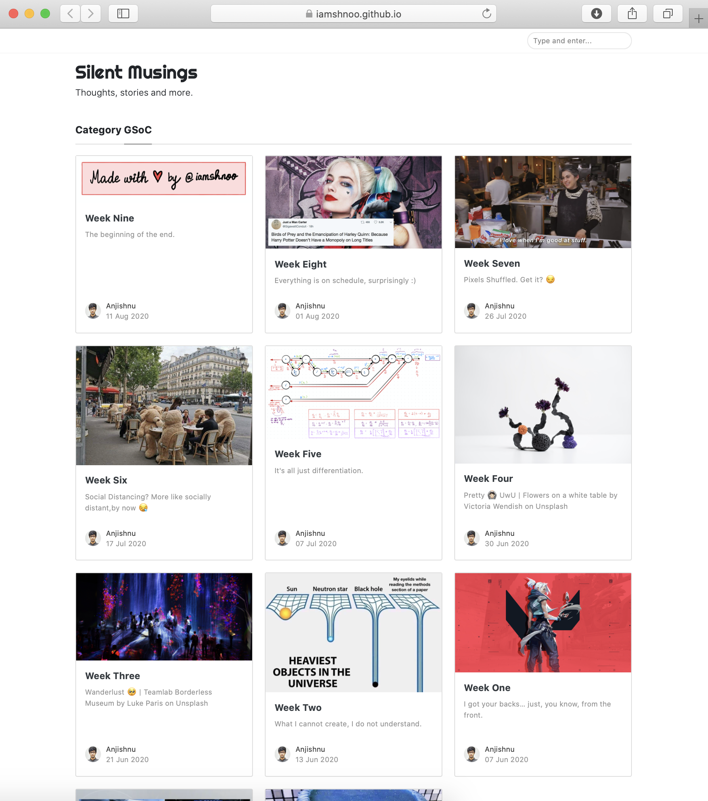
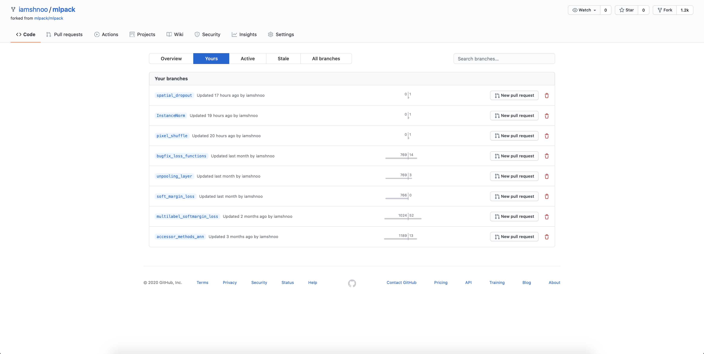
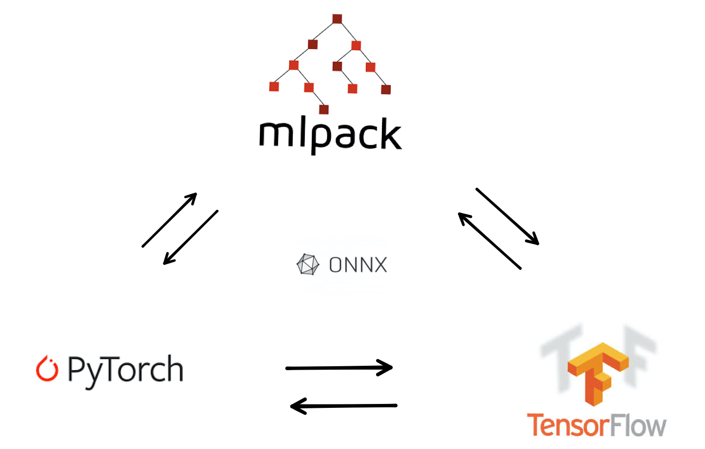

<div align="center">

<p></p>
</div>

# mlpack-testing

This repository contains verifications, tests and visualizations for different
mlpack features I have worked on. Each feature is structured into a separate
folder, each of which has a README describing its contents and how to execute
the sample code included within., along with links to PRs and blogs I have
created. The dependencies for running each file are also listed there itself.
To view the READMEs as web-pages, you can visit the pages of the following
format.

```html
https://iamshnoo.github.io/mlpack-testing/{feature-name}
```

For the current {feature-name} options, these can thus be one of the following :

- [instance_norm](https://iamshnoo.github.io/mlpack-testing/instance_norm)
- [loss_functions](https://iamshnoo.github.io/mlpack-testing/loss_functions)
- [multilabel_soft_margin_loss](https://iamshnoo.github.io/mlpack-testing/multilabel_soft_margin_loss),
- [pixel_shuffle](https://iamshnoo.github.io/mlpack-testing/pixel_shuffle)
- [soft_margin_loss](https://iamshnoo.github.io/mlpack-testing/soft_margin_loss)
- [spatial_dropout](https://iamshnoo.github.io/mlpack-testing/spatial_dropout)
- [unpool](https://iamshnoo.github.io/mlpack-testing/unpool)

I have also worked on a couple of PRs which can't really be presented in the
format I follow in this repository.  I am listing all my PRs below for
reference so that all the features can be accessed from one place.

---

## Blogs

My blogs for GSoC can be found at [this link](https://iamshnoo.github.io/blog/categories#GSoC).
I write one every week ;)

<div align="center">

<p></p>
</div>

---

## mlpack/mlpack

[Here](https://github.com/iamshnoo/mlpack/branches) is a list of all the
branches I have worked on so far.

<div align="center">

<p></p>
</div>

### All PRs

1. ANN Accessor Methods - [PR #2321](https://github.com/mlpack/mlpack/pull/2321)
2. MultiLabel Soft Margin Loss - [PR #2345](https://github.com/mlpack/mlpack/pull/2345)
3. UnPool Layer - [PR #2493](https://github.com/mlpack/mlpack/pull/2493)
4. Soft Margin Loss - [PR #2494](https://github.com/mlpack/mlpack/pull/2494)
5. Re-design ANN loss functions along with some bug fixes - [PR #2495](https://github.com/mlpack/mlpack/pull/2495)
6. Instance Norm Layer - [PR #2562](https://github.com/mlpack/mlpack/pull/2562)
7. Pixel Shuffle Layer - [PR #2563](https://github.com/mlpack/mlpack/pull/2563)
8. Spatial Dropout layer - [PR #2564](https://github.com/mlpack/mlpack/pull/2564)

### All Issues

1. Accessor method implementations for layers in ANN module - [Issue #2258](https://github.com/mlpack/mlpack/issues/2258)
2. Modifying maxpooling.hpp to access poolingIndices - [Issue #2439](https://github.com/mlpack/mlpack/issues/2439)
3. Some of the loss functions probably don't work correctly - [Issue #2444](https://github.com/mlpack/mlpack/issues/2444)

---

## mlpack-TensorFlow-Translator

<div align="center">

<p></p>
</div>

I have also contributed to
[mlpack-TensorFlow-Translator](https://github.com/sreenikSS/mlpack-Tensorflow-Translator)
in the last couple of weeks. The work done so far can be tracked down to the
following single large PR that incorporates many changes across the entire
source code. Currently, there are only a couple more issues left to resolve to
bring the translator to a complete working state.

- [PR #2](https://github.com/sreenikSS/mlpack-Tensorflow-Translator/pull/2/)

---

- If any of the links are broken, and you can't access them, let me know by
  creating a issue here and I will update them right away!

- If you find any issues/bugs in any of the implementations, mention them here or in the official
mlpack repository depending on whether the features have been merged yet or not,
and I will fix them ASAP.

Suggestions and feedback always welcome! Thanks.

<div align="center">

<p></p>
</div>
