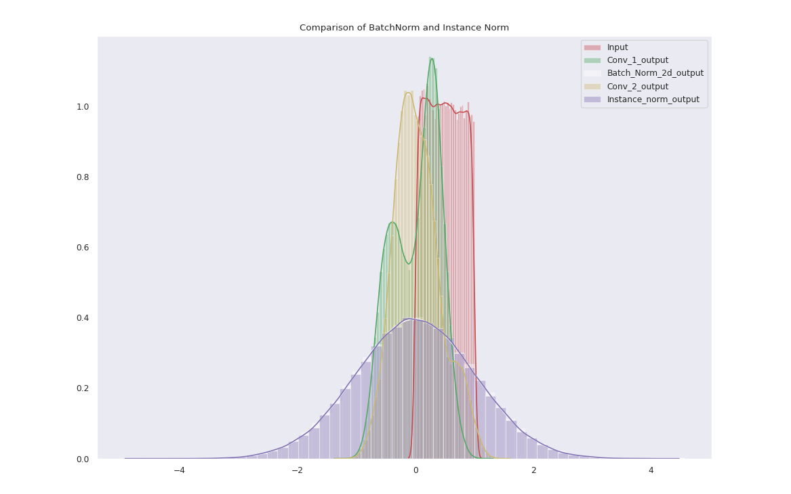
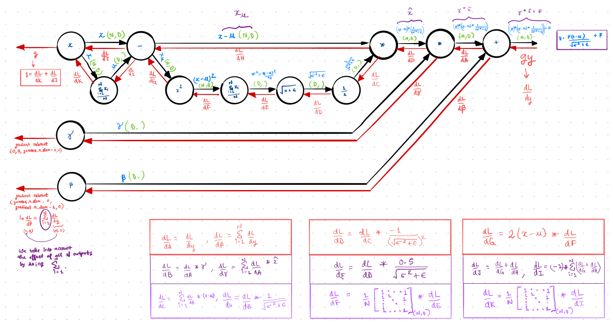
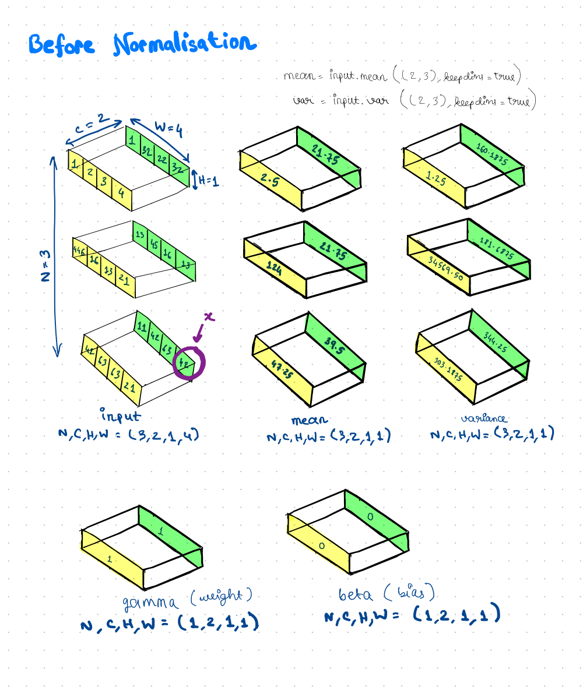

# Instance Norm

Contains all the work done on the Instance Norm layer.

<div align="center">

</div>

## Link to PR

[#2562](https://github.com/mlpack/mlpack/pull/2562)

## Link to Blogs

- [Blog post 1](https://iamshnoo.github.io/blog/week-4/)

  <div align="center">
  
  <p>Comparing batchnorm and instance norm for a single image <br>
  Batch Norm (white) is almost perfectly eclipsed by Instance Norm (magenta).</p>
  </div>

- [Blog post 2](https://iamshnoo.github.io/blog/week-5/)

  <div align="center">
  
  <p>Deriving the equations for the BatchNorm/Instance Norm function.<br>
  Thank you CS231n.</p>
  </div>

  <div align="center">
  
  <p>Visualizing the calculations of mean and variance for Instance Norm.</p>
  </div>

## What's in this folder

1. ```Normalisation_Visualisations.ipynb``` - to recreate the visuals in blog
   post 1.
2. ```Instance_Norm_as_BatchNorm_wrapper.ipynb``` - comparison between PyTorch/numpy
   and mlpack/armadillo implementations of the layer.
3. ```test.cpp``` - An initial approach I tried for writing the layer as an
   independent unit and not as a wrapper of BatchNorm.
4. ```bn.cpp``` - The final implementation chosen where the layer is created as
   a wrapper of the BatchNorm class.

## How to run

To run the ```.cpp``` files, you need to have [armadillo](http://arma.sourceforge.net) installed in your system.

```bash
g++ test.cpp -o test -larmadillo && ./test
g++ bn.cpp -o bn -larmadillo && ./test
```

To run  ```Normalisation_Visualisations.ipynb```, you would need pytorch,
torchvision, matplotlib, seaborn, numpy, PIL python libraries.

To run  ```Instance_Norm_as_BatchNorm_wrapper.ipynb```, you would need pytorch,
numpy and armadillo. To avoid issues with linking the libraries correctly, it is
better to run the notebook in Google Colab.

## Google Colab links for notebooks

- [Normalisation_Visualisations](https://colab.research.google.com/drive/1RrBy8GD4rSqbPhVaVPItKQyAIL0cTOwI?usp=sharing)

- [Instance_Norm_as_BatchNorm_wrapper](https://colab.research.google.com/drive/18E8a-LTHFOpqa6w53vOsjRz7nbRHLvaf?usp=sharing)
