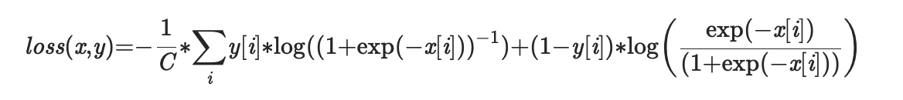

# Multi Label Soft Margin Loss

Contains work done on the Multi Label Soft Margin Loss.
Most of this work was done prior to getting selected for GSoC'20.

## Link to PR

[#2345](https://github.com/mlpack/mlpack/pull/2345)

## What this folder contains

Jupyter Notebook comparing PyTorch/numpy implementation of the above
loss function with mlpack/armadillo implementation.

## How to run

To run the notebook, you would need pytorch,
numpy and armadillo. To avoid issues with linking the libraries correctly, it is
better to run the notebook in Google Colab.

## Google Colab link for notebook

[Multi Label Soft Margin Loss](https://colab.research.google.com/drive/1VLcqUmj7obURRYOnuWGxU9LVeEi6I-98?usp=sharing)
