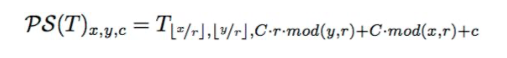
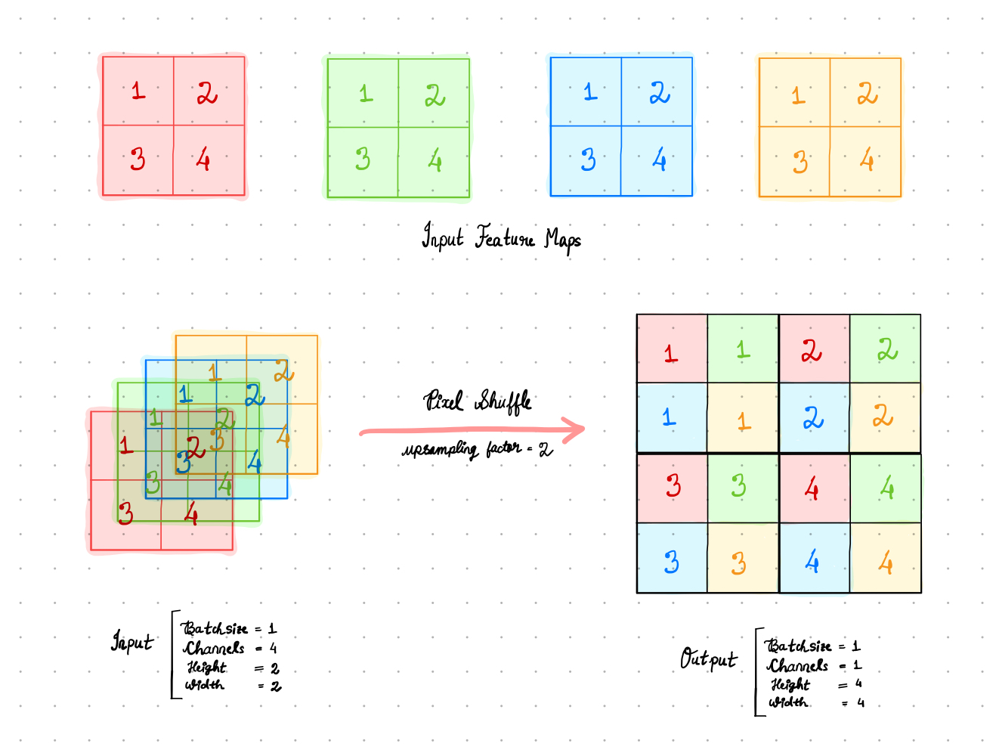

# Pixel Shuffle

Contains all the work done on the Pixel Shuffle layer.
<div align="center">

</div>

## Link to PR

[#2563](https://github.com/mlpack/mlpack/pull/2563)

## Link to Blogs

- [Blog post 1](https://iamshnoo.github.io/blog/week-6/)
- [Blog post 2](https://iamshnoo.github.io/blog/week-7/)

  <div align="center">
  
  <p>Probably the most intuitive illustration of Pixel Shuffle on the internet.<br>
      I had a lot of fun understanding and making this.</p>
  </div>

## What's in this folder

1. ```Pixel_Shuffle_Demo_1.ipynb``` - understanding the PyTorch implementation
   of the layer.
2. ```Pixel_Shuffle_Demo_2.ipynb``` - comparison between PyTorch/numpy
   and mlpack/armadillo implementations of the layer.
3. ```Pixel_Shuffle_Visual_Experiments.ipynb``` - to recreate the visuals in blog
   post 2.
4. ```test.cpp``` - Armadillo implementation of the layer's functionality.

## How to run

To run the ```.cpp``` file, you need to have [armadillo](http://arma.sourceforge.net) installed in your system.

```bash
g++ test.cpp -o test -larmadillo && ./test
```

To run  ```Pixel_Shuffle_Demo_1.ipynb```, you would need pytorch and numpy
python libraries.

To run  ```Pixel_Shuffle_Demo_2.ipynb```, you would need pytorch,
numpy and armadillo. To avoid issues with linking the libraries correctly, it is
better to run the notebook in Google Colab.

To run  ```Pixel_Shuffle_Visual_Experiments.ipynb```, you would need pytorch,
matplotlib, seaborn, numpy python libraries.

## Google Colab links for notebooks

- [Pixel Shuffle Demo 1](https://colab.research.google.com/drive/1C7W51LvcTccRxKJGZ5m61DDzR4P6fW1T?usp=sharing)
- [Pixel Shuffle Demo 2](https://colab.research.google.com/drive/1JZaptTDo2ey8GcwnJMFh3IwSAlqd7in_?usp=sharing)
- [Pixel Shuffle Visual Experiments](https://colab.research.google.com/drive/1Be7aIpXMSp_VeL8D5da5p-CYTD-nPIVh?usp=sharing)
