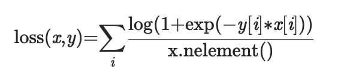

# Soft Margin Loss

Contains work done on the Soft Margin Loss function.
<div align="center">

</div>

## Link to PR

[#2494](https://github.com/mlpack/mlpack/pull/2494)

## Link to Blog

[Blog post](https://iamshnoo.github.io/blog/week-1/)

## What's in this folder

1. ```Soft_Margin_Loss.ipynb``` - comparison between PyTorch/numpy
   and mlpack/armadillo implementations of the layer.
2. ```test.cpp``` - Armadillo implementation of the loss function's functionality.

## How to run

To run the ```.cpp``` files, you need to have [armadillo](http://arma.sourceforge.net) installed in your system.

```bash
g++ test.cpp -o test -larmadillo && ./test
```

To run  ```Soft_Margin_Loss.ipynb```, you would need pytorch,
numpy and armadillo. To avoid issues with linking the libraries correctly, it is
better to run the notebook in Google Colab.

## Google Colab link for notebook

[Soft Margin Loss](https://colab.research.google.com/drive/1W4ndom2jMmsGhraNf17VacOzk2Q748k8?usp=sharing)
