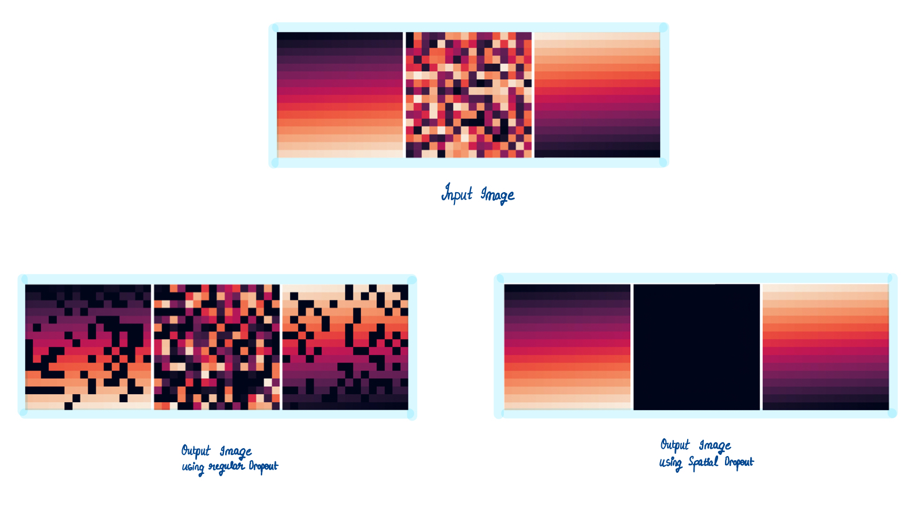

# Spatial Dropout

Contains all the work done on the Spatial Dropout layer.

## Link to PR

[#2564](https://github.com/mlpack/mlpack/pull/2564)

## Link to Blogs

[Blog post ](https://iamshnoo.github.io/blog/week-8/)

  <div align="center">
  
  <p>Comparing regular Dropout with Spatial Dropout.</p>
  </div>

## What's in this folder

1. ```Spatial_Dropout Visualisation.ipynb``` - to recreate the visuals in blog
   post 1.
2. ```Spatial_Dropout_demo.ipynb``` - comparison between PyTorch/numpy
   and mlpack/armadillo implementations of the layer.
3. ```test.cpp``` - The final implementation chosen where the layer is created as
   a wrapper of the BatchNorm class.

## How to run

To run the ```.cpp``` file, you need to have [armadillo](http://arma.sourceforge.net) and [mlpack](https://www.mlpack.org) installed
in your system.

```bash
g++ -std=c++11 -stdlib=libc++ test.cpp -o test -larmadillo -lmlpack && ./test
```

To run  ```Spatial_Dropout Visualisation.ipynb```, you would need pytorch,
matplotlib, seaborn, numpy python libraries.

To run  ```Spatial_Dropout_demo.ipynb```, you would need pytorch,
numpy and armadillo. To avoid issues with linking the libraries correctly, it is
better to run the notebook in Google Colab.

## Google Colab links for notebooks

- [Spatial Dropout Visualisation](https://colab.research.google.com/drive/1FZaEeq6pQe8eSQFcpAZXwBsWYhf59OoV?usp=sharing)
- [Spatial Dropout demo](https://colab.research.google.com/drive/13TbYROndyUb7xvY0AIXJ5Px87yhW0ewh?usp=sharing)
