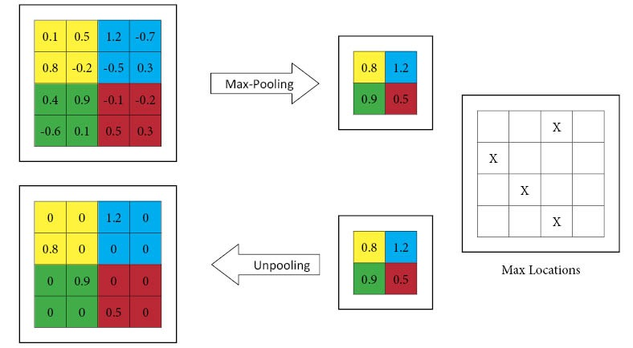

# UnPool layer

Contains all the work done on the UnPooling layer.
This layer does an approximate inverse of the Max Pool operation.

## Link to PR

[#2493](https://github.com/mlpack/mlpack/pull/2493)

## Link to Blogs

- [Blog post 1](https://iamshnoo.github.io/blog/week-0/)
- [Blog post 2](https://iamshnoo.github.io/blog/week-1/)

  <div align="center">
  
  <p>MaxPooling Operation and Corresponding UnPool operation.</p>
  </div>

## What's in this folder

1. ```UnPool.ipynb``` - Understanding the working of the PyTorch layer.
2. ```test.cpp``` - Armadillo implementation of the layer's functionality.
3. ```maxpool.txt``` - The output obtained from running the cpp file.

## How to run

To run the ```.cpp``` file, you need to have [armadillo](http://arma.sourceforge.net) installed in your system.

```bash
g++ test.cpp -o test -larmadillo && ./test > maxpool.txt
```

To run  ```UnPool.ipynb```, you would need the pytorch
python library.

## Google Colab link for notebook

[UnPool layer](https://colab.research.google.com/drive/1JvlHXUT0i9zrzRRpxlB1FB4ABk1j-3fV?usp=sharing)
